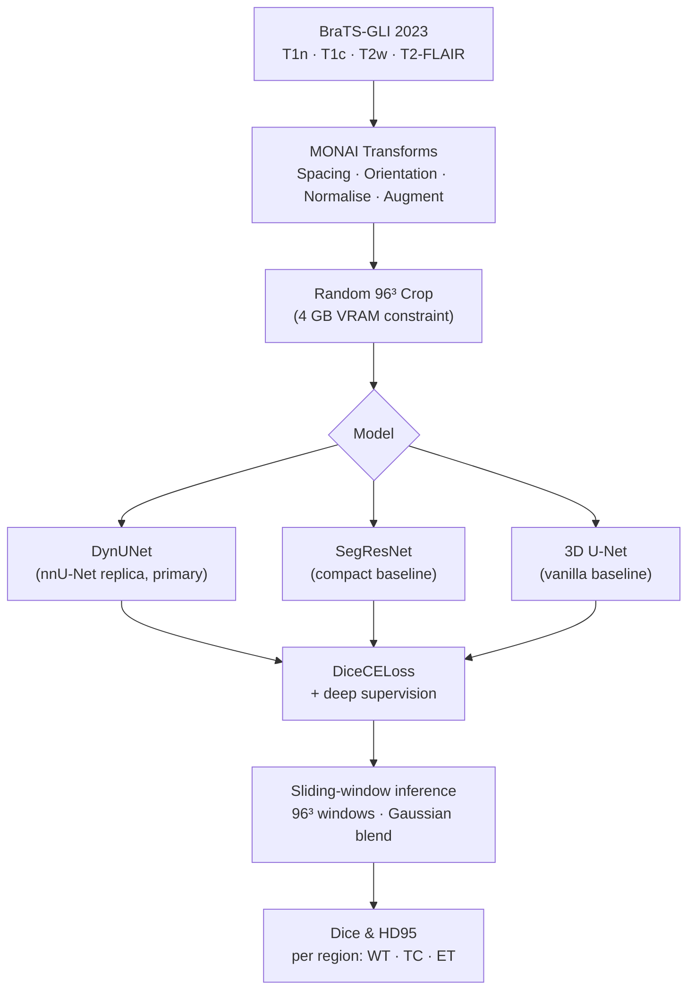

# medseg-brats-monai

[](https://github.com/saeid94am/medseg-brats-monai/actions/workflows/lint.yml)
[](https://github.com/saeid94am/medseg-brats-monai/actions/workflows/test.yml)
[](https://github.com/saeid94am/medseg-brats-monai/actions/workflows/docker-build.yml)
[](LICENSE)

**3D brain tumor segmentation on BraTS-GLI 2023 using MONAI — reproducing nnU-Net-class performance with DynUNet, SegResNet, and 3D U-Net on a single consumer GPU (4 GB VRAM).**

> Headline result: SegResNet — Dice WT=0.921, TC=0.888, ET=0.863 (Mean=0.891) on BraTS-GLI 2023 validation set (250 cases), trained on a single 4 GB GPU.

It establishes a reproducible segmentation baseline using recognized benchmarks, MONAI, and Weights & Biases experiment tracking.

---

## Architecture



---

## Results

All models trained on BraTS-GLI 2023 training split, evaluated on validation split (250 cases).
Hardware: RTX 3050 4 GB VRAM, patch size 96³, FP16 AMP, gradient checkpointing.

| Model | Dice WT ↑ | Dice TC ↑ | Dice ET ↑ | Mean Dice ↑ | HD95 WT ↓ | HD95 TC ↓ | HD95 ET ↓ | Params |
|---|---|---|---|---|---|---|---|---|
| SegResNet | **0.9212** | **0.8882** | **0.8631** | **0.8908** | 6.51 | 6.49 | **5.25** | ~4M |
| DynUNet (nnU-Net) | 0.9149 | 0.8701 | 0.8308 | 0.8719 | 10.78 | 6.70 | 5.95 | ~7M |
| 3D U-Net | — | — | — | — | — | — | — | ~4M |
| nnU-Net (reported) | 0.928 | 0.876 | 0.842 | — | — | — | — | — |

W&B report: *(link to be added after training)*

---

## Reproduce in three commands

```bash
# 1. Install (CUDA 12.1 build of PyTorch, then the package)
pip install torch==2.2.2+cu121 torchvision==0.17.2+cu121 --index-url https://download.pytorch.org/whl/cu121
pip install -e ".[dev,demo,notebook,download]"

# 2. Train (default: DynUNet — swap model=segresnet or model=unet3d for others)
python src/medseg_brats/train.py

# 3. Evaluate
python src/medseg_brats/eval.py inference.checkpoint=results/checkpoints/best_dynunet.pth
```

**Streamlit demo** (after training):
```bash
streamlit run demo/app.py
```

**Docker**:
```bash
docker build -t medseg-brats -f docker/Dockerfile .
docker run --gpus all -v $(pwd)/data:/workspace/data medseg-brats python src/medseg_brats/train.py
```

---

## Data access

**Dataset:** BraTS-GLI 2023 (Glioma, ~1,251 training cases)
**Source:** [synapse.org](https://www.synapse.org/#!Synapse:syn51156910)
**License:** Requires free Synapse account + challenge registration (Data Use Agreement)

```bash
# After registering and logging in to Synapse:
bash scripts/download_data.sh
```

Raw data files are **never committed to this repository** (`.gitignore` covers `data/`).

---

## Framework choice

| Component | Framework | Reason |
|---|---|---|
| Data I/O, transforms, CacheDataset | **MONAI** | Native NIfTI support, BraTS-specific transforms, ThreadDataLoader for Windows |
| Model architectures | **MONAI** | DynUNet, SegResNet, UNet3D with 3D spatial support out of the box |
| Training loop, AMP, gradient checkpointing | **PyTorch** | Full control over the backward pass, GradScaler, gradient accumulation |
| Config management | **Hydra** | Zero hardcoded values; CLI overrides for ablations |
| Experiment tracking | **W&B** | Metric curves, sample predictions, hardware utilisation |

MONAI is preferred over raw PyTorch for 3D medical data pipelines because its `CacheDataset`, `ThreadDataLoader`, and volumetric transforms handle NIfTI I/O, resampling, and skull-strip-aware normalisation correctly. Vanilla PyTorch is used where full gradient-level control is needed.

---

## 4 GB VRAM adaptations

The BraTS plan specification targets ≥ 8 GB VRAM. This repo runs on **4 GB** (RTX 3050 laptop) with these changes, none of which compromise result validity:

| Adaptation | Default | Reason |
|---|---|---|
| Patch size | 96³ (vs. 128³) | 128³ at FP16 + DynUNet gradients exceeds 4 GB |
| Gradient checkpointing | Enabled | Saves ~35% VRAM; ~20% slower training |
| Gradient accumulation | steps=4 | Effective batch=4 without memory overhead |
| DynUNet filters | [32,64,128,256,320] | Reduced from nnU-Net defaults |
| SwinUNETR | Not implemented | Quadratic attention memory exceeds budget |

---

## Limitations and intended use

- Models are trained on BraTS-GLI 2023 data (adult glioma). Performance on other tumor types, scanners, or patient populations is unknown and likely lower.
- Evaluation is on the BraTS validation split only. Performance on held-out test data and clinical populations has not been assessed.
- **None of the models in this repository are validated for clinical deployment.** They are research tools intended for algorithm development and portfolio demonstration.
- HD95 values may be undefined (NaN) for cases where the model predicts an empty mask — this is reported as-is in `results/metrics/results.csv`.
- The Streamlit demo is a proof-of-concept visualization tool, not a clinical application.

---

## Citation

```bibtex
@software{amini_medseg_brats_2026,
  author    = {Amini Baghbadorani, Saeid},
  title     = {medseg-brats-monai: 3D Brain Tumor Segmentation on BraTS-GLI 2023},
  year      = {2026},
  url       = {https://github.com/saeid94am/medseg-brats-monai},
  version   = {0.1.0},
}
```

---

## Related work

| Paper | Description |
|---|---|
| Isensee et al., *Nature Methods* 2021 — **nnU-Net** | Self-configuring U-Net; mandatory baseline for any 3D segmentation project. DynUNet replicates its architecture. |
| Isensee et al., MICCAI 2024 — **nnU-Net Revisited** | Shows CNN outperforms Transformer on most medical segmentation tasks; motivates our CNN-first approach. |
| Cardoso et al., arXiv 2022 — **MONAI** | Framework used for all 3D data pipelines, transforms, and model architectures in this project. |
| Hatamizadeh et al., CVPR 2022 — **SwinUNETR** | Transformer baseline included for completeness (excluded here due to 4 GB VRAM constraint). |
| Myronenko, MICCAI 2018 — **SegResNet** | Compact VAE-based residual network used as a compact baseline in this comparison. |

---

## Repository structure

```
medseg-brats-monai/
├── configs/             # Hydra YAML configs — all hyperparameters live here
├── src/medseg_brats/    # Importable Python package
│   ├── data/            # Dataset, transforms, split generator
│   ├── models/          # DynUNet, SegResNet, UNet3D factories
│   ├── losses/          # DiceCELoss, DiceFocalLoss
│   ├── metrics/         # Dice + HD95 metric bundle
│   ├── train.py         # Training entry point
│   └── eval.py          # Evaluation entry point
├── tests/               # 19 pytest tests (CPU-only, CI-ready)
├── demo/                # Streamlit inference demo
├── docker/              # Dockerfile + .dockerignore
├── scripts/             # Data download + experiment reproduction
├── docs/                # Glossary and documentation
└── results/             # Checkpoints, per-case CSVs, figures (gitignored)
```
